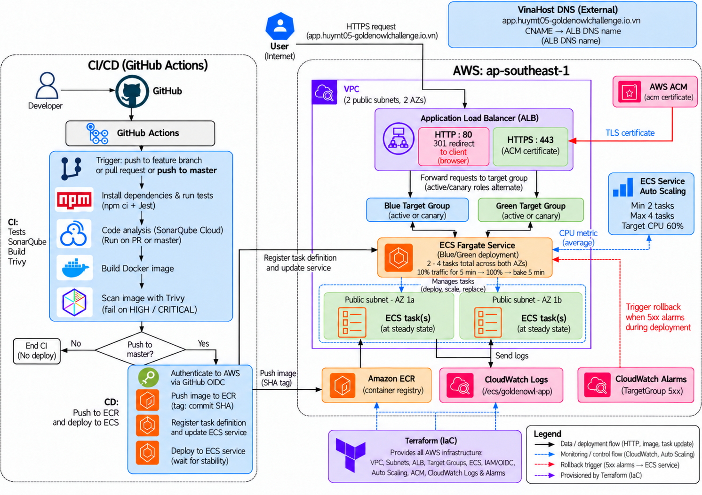

# Golden Owl DevOps Internship Challenge

[](https://github.com/huymt05/goldenowl-devops-internship-challenge/actions/workflows/ci.yaml?query=branch%3Amaster)

## English

### Overview

This repository contains a Node.js API deployed to AWS ECS Fargate. GitHub Actions runs CI/CD, Amazon ECR stores container images, and Terraform provisions **all AWS infrastructure**; no infrastructure resources need to be created manually in the AWS Console. The application runs behind an HTTPS Application Load Balancer (ALB) with ECS Service Auto Scaling and alarm-based deployment rollback. The domain and its DNS records are managed separately at VinaHost.

### Repository structure

```text
.
├── .github/workflows/ci.yaml   # CI/CD: tests, SonarQube, Trivy, ECR, ECS
├── Dockerfile                  # Multi-stage, non-root container image
├── src/                        # Node.js API and unit tests
├── terraform/
│   ├── bootstrap/
│   │   └── main.tf             # S3 state bucket and ECR repository
│   └── app/
│       ├── main.tf             # VPC, ALB/HTTPS, ACM, ECS, alarms, scaling
│       ├── iam.tf              # IAM roles and GitHub OIDC trust
│       └── outputs.tf          # HTTPS URL, ACM DNS record, identifiers
└── docs/evidence/              # Architecture diagram and AWS screenshots
```

Apply `terraform/bootstrap` first, publish the initial `bootstrap` image to ECR, and then apply `terraform/app`.

### Results

| Item | Result |
| --- | --- |
| Source code | [Public GitHub repository](https://github.com/huymt05/goldenowl-devops-internship-challenge) |
| Deployed application | [HTTPS application endpoint](https://app.huymt05-goldenowlchallenge.io.vn/) |
| API response | `{"message":"Welcome warriors to Golden Owl!"}` (verified over HTTPS) |
| HTTPS | ACM certificate issued; HTTP port 80 redirects to HTTPS port 443 with `301` |
| CI/CD | [Master workflow runs](https://github.com/huymt05/goldenowl-devops-internship-challenge/actions/workflows/ci.yaml?query=branch%3Amaster); the badge above shows the current status |
| Final container image size | **53,650,745 bytes (~53.7 MB / 51.2 MiB)**, reported by Amazon ECR for the image referenced by the ECS service task definition |
| AWS region | `ap-southeast-1` (Singapore) |

The application returns JSON; it has no frontend. Test the public endpoint with:

```bash
curl -i https://app.huymt05-goldenowlchallenge.io.vn/
curl -I http://app.huymt05-goldenowlchallenge.io.vn/
```

### Visual flow diagram



The diagram shows the CI/CD workflow and the current AWS deployment architecture, including HTTPS, ECS Service Auto Scaling, native canary deployment, and alarm-based rollback. The [deployment screenshots](#deployment-evidence) provide supporting evidence.

### CI/CD pipeline

The workflow is defined in [`.github/workflows/ci.yaml`](.github/workflows/ci.yaml).

| Event | Unit tests | SonarQube Cloud | Docker build + Trivy | Push to ECR + deploy to ECS |
| --- | --- | --- | --- | --- |
| Push to `feature/**` | Yes | Skipped | Yes | No |
| Pull request to `master` | Yes | Yes | Yes | No |
| Push to `master` | Yes | Yes | Yes | Yes, after the checks pass |

The unit-test job runs `npm ci` and Jest with coverage. The image job runs only after the quality job succeeds; publishing to ECR and deployment are restricted to pushes on `master`.

Trivy fails the image job for fixable `HIGH` or `CRITICAL` vulnerabilities. Released images are tagged with the Git commit SHA. For deployment, GitHub Actions assumes an AWS IAM role through OIDC, renders a new ECS task definition, updates the ECS service, and waits for stability. No long-lived AWS access keys are stored in GitHub.

ECS uses its **native canary strategy**: 10% of traffic goes to the new revision for 5 minutes, then traffic moves to 100%, followed by a 5-minute bake period. CloudWatch alarms watch target-group 5xx responses; an alarm during deployment triggers ECS rollback.

Configure these GitHub Actions repository **variables**: `AWS_ROLE_ARN`, `AWS_REGION`, `ECR_REPOSITORY`, `ECS_CLUSTER`, `ECS_SERVICE`, `ECS_TASK_FAMILY`, and `ECS_CONTAINER_NAME`. Store `SONAR_TOKEN` as a repository **secret**. Do not commit credentials or tokens.

### AWS architecture and Terraform

All AWS infrastructure is defined and provisioned with Terraform; nothing needs to be created manually through the AWS Console.

- [`terraform/bootstrap`](terraform/bootstrap/main.tf) creates a versioned, encrypted S3 bucket for Terraform state and an ECR repository with immutable image tags.
- [`terraform/app`](terraform/app/main.tf) creates the VPC, two public subnets in separate Availability Zones, security groups, internet-facing ALB, two target groups, ECS Fargate service, ACM certificate, CloudWatch log group and 5xx alarms, IAM roles, GitHub OIDC provider, and ECS Service Auto Scaling.

VinaHost DNS maps `app.huymt05-goldenowlchallenge.io.vn` to the ALB and hosts the ACM validation CNAME. The ALB terminates TLS with the ACM certificate on port **443**; port **80** returns a `301` redirect to HTTPS. ALB-to-task traffic remains HTTP on port **3000**, accessible only from the ALB security group. The ECS service starts with **2 tasks** and scales between **2 and 4 tasks**, targeting **60% average CPU utilization**. Tasks send application logs to `/ecs/goldenowl-app`, retained for 7 days. Blue and green target-group alarms enter `ALARM` after at least **3 target 5xx responses in each of two consecutive 60-second periods**; ECS is configured to roll back an affected deployment. Missing metrics from an idle target group do not trigger the alarm.

#### Provisioning a fresh environment

Prerequisites: Terraform >= 1.10, Docker, AWS CLI, and AWS credentials with permission to provision the listed resources. Node.js 24 and npm are needed to run the application locally.

These commands are for a **new deployment**. The Terraform S3 backend, ECR name, AWS region, domain, and GitHub OIDC trust subject are specific to this account and fork; update them before reuse. Preserve the bootstrap Terraform state: applying from another checkout without that state can conflict with existing resources. Register a domain with authoritative DNS access; VinaHost DNS records are managed outside Terraform.

```powershell
terraform -chdir=terraform/bootstrap init
terraform -chdir=terraform/bootstrap apply

$ecr = terraform -chdir=terraform/bootstrap output -raw ecr_repository_url
$registry = $ecr.Split('/')[0]
aws ecr get-login-password --region ap-southeast-1 | docker login --username AWS --password-stdin $registry
docker build -t goldenowl-app:bootstrap .
docker tag goldenowl-app:bootstrap "${ecr}:bootstrap"
docker push "${ecr}:bootstrap"

terraform -chdir=terraform/app init
terraform -chdir=terraform/app plan '-target=aws_acm_certificate.app' -out acm.tfplan
terraform -chdir=terraform/app apply acm.tfplan
terraform -chdir=terraform/app output acm_validation_record
```

Add the returned ACM validation CNAME to the authoritative DNS zone and wait until the certificate status is `ISSUED`. Then review and apply the full plan:

```powershell
$certArn = terraform -chdir=terraform/app output -raw acm_certificate_arn
aws acm describe-certificate --region ap-southeast-1 --certificate-arn $certArn --query 'Certificate.Status' --output text
terraform -chdir=terraform/app plan -out https.tfplan
terraform -chdir=terraform/app show https.tfplan
terraform -chdir=terraform/app apply https.tfplan
terraform -chdir=terraform/app output alb_dns_name
terraform -chdir=terraform/app output deployment_url
```

Do **not** run the full apply until ACM reports `ISSUED`. Once the ALB exists, add an `app` CNAME pointing to the `alb_dns_name` output in VinaHost DNS. The initial ECS task definition references the ECR `bootstrap` image. Later releases are built and deployed by GitHub Actions. Running AWS resources incur charges.

### Docker image

The [Dockerfile](Dockerfile) uses a multi-stage build. The `node:24-alpine3.24` build stage installs only production dependencies with `npm ci --omit=dev`. The final `alpine:3.24` stage copies the Node.js binary, application code, and production dependencies, but **does not include npm**. It runs as non-root UID/GID `1000:1000`, with `dumb-init` forwarding process signals. [`.dockerignore`](.dockerignore) excludes files unnecessary for the build.

To check the image size for the task definition currently attached to the ECS service, run this in PowerShell after deployment has stabilized:

```powershell
$taskDefinition = aws ecs describe-services --region ap-southeast-1 --cluster goldenowl-cluster --services goldenowl-service --query 'services[0].taskDefinition' --output text
$imageUri = aws ecs describe-task-definition --region ap-southeast-1 --task-definition $taskDefinition --query 'taskDefinition.containerDefinitions[0].image' --output text
$imageTag = $imageUri.Split(':')[-1]
aws ecr describe-images --region ap-southeast-1 --repository-name goldenowl-app --image-ids "imageTag=$imageTag" --query 'imageDetails[0].imageSizeInBytes' --output text
```

The size in the results table was measured with these commands against the current ECS service task definition. Re-run them and update the number after any later deployment. ECR reports size in bytes, not the local uncompressed size shown by `docker images`. The image tag is the deployed Git commit SHA; check the linked workflow runs to confirm the latest release succeeded.

### Run locally

```bash
cd src
npm ci
npm test
npm start
```

Open `http://localhost:3000/` or run `curl http://localhost:3000/`. To run the container from the repository root:

```bash
docker build -t goldenowl-app:local .
docker run --rm -p 3000:3000 goldenowl-app:local
```

### Deployment evidence

These screenshots show the configured AWS resources; they do not replace the required manually drawn diagram.

- [ECS native canary deployment: 10%, 5 minutes](docs/evidence/ecs-canary.png)
- [Active ECS Auto Scaling policy: 2–4 tasks, CPU 60%](docs/evidence/auto-scaling.png)
- [Active internet-facing Application Load Balancer](docs/evidence/alb-loadbalancer.png)
- [Issued ACM certificate for the application domain](docs/evidence/acm-issued.png)
- [ALB HTTP 80 → HTTPS 443 redirect and HTTPS listener](docs/evidence/alb-certificate.png)
- [Blue/green target-group 5xx CloudWatch alarms](docs/evidence/cloudwatch-alarms.png)
- [ECS alarm-based rollback enabled (`enable` and `rollback` are `true`)](docs/evidence/ecs-rollback-config.png)

The CloudWatch screenshot also shows an unrelated ECS CPU Auto Scaling alarm in `ALARM`; both deployment 5xx alarms are `OK`. The rollback screenshot proves the configuration is enabled, not that a rollback has occurred.

---

## Tiếng Việt

### Tổng quan

Đây là API Node.js trả về JSON, triển khai trên ECS Fargate tại `ap-southeast-1`. GitHub Actions chạy unit test, SonarQube Cloud, build image, quét Trivy và chỉ đẩy ECR/triển khai ECS khi push lên `master`. Terraform quản lý hạ tầng AWS trong hai phần [`bootstrap`](terraform/bootstrap/main.tf) (S3 state, ECR) và [`app`](terraform/app/main.tf) (VPC, ALB, ACM, ECS, IAM/OIDC, Auto Scaling và CloudWatch). Tên miền cùng DNS được quản lý riêng tại VinaHost.

### Kết quả

| Hạng mục | Kết quả |
| --- | --- |
| Ứng dụng đã triển khai | [Endpoint HTTPS](https://app.huymt05-goldenowlchallenge.io.vn/) |
| Phản hồi | `{"message":"Welcome warriors to Golden Owl!"}`; không có frontend |
| HTTPS | ACM cấp chứng chỉ; ALB chuyển HTTP `:80` sang HTTPS `:443` bằng `301` |
| CI/CD | [Các workflow run trên master](https://github.com/huymt05/goldenowl-devops-internship-challenge/actions/workflows/ci.yaml?query=branch%3Amaster); badge đầu trang hiển thị trạng thái hiện tại |
| Kích thước container image cuối | **53.650.745 byte (~53,7 MB / 51,2 MiB)** theo Amazon ECR, lấy từ image trong ECS service task definition; đo lại nếu deploy phiên bản mới |

### Sơ đồ quy trình và kiến trúc

[Sơ đồ kiến trúc ở phần trên](#visual-flow-diagram) thể hiện CI/CD và hệ thống hiện tại: HTTPS với ACM, ECS Auto Scaling, canary 10% trong 5 phút rồi 100% với bake 5 phút, cùng rollback khi alarm 5xx kích hoạt trong quá trình triển khai. DNS VinaHost được quản lý ngoài Terraform. Xem [mô tả kiến trúc](#aws-architecture-and-terraform) và [ảnh minh chứng](#deployment-evidence) ở phần tiếng Anh.

### Cách kiểm tra và triển khai

Kiểm tra ứng dụng bằng `curl -i https://app.huymt05-goldenowlchallenge.io.vn/` và chuyển hướng bằng `curl -I http://app.huymt05-goldenowlchallenge.io.vn/`. Để cấp phát môi trường mới, làm theo [thứ tự bootstrap → image đầu tiên → app/ACM/DNS](#provisioning-a-fresh-environment); cần giữ Terraform state và sửa các giá trị gắn với tài khoản này trước khi dùng lại. Xem [lệnh chạy cục bộ](#run-locally), [workflow CI/CD](#cicd-pipeline) và [lệnh kiểm tra kích thước image ECR](#docker-image) ở phần tiếng Anh. Tài nguyên AWS có thể phát sinh chi phí.

### Bằng chứng

Ảnh [ACM đã cấp](docs/evidence/acm-issued.png) và [listener ALB HTTP/HTTPS](docs/evidence/alb-certificate.png) xác nhận cấu hình TLS/chuyển hướng. Ảnh [hai alarm 5xx](docs/evidence/cloudwatch-alarms.png) cùng [cấu hình ECS rollback](docs/evidence/ecs-rollback-config.png) cho thấy rollback **đã bật**, không khẳng định từng xảy ra rollback. Các ảnh [canary](docs/evidence/ecs-canary.png), [Auto Scaling](docs/evidence/auto-scaling.png) và [ALB](docs/evidence/alb-loadbalancer.png) bổ sung bằng chứng triển khai.
